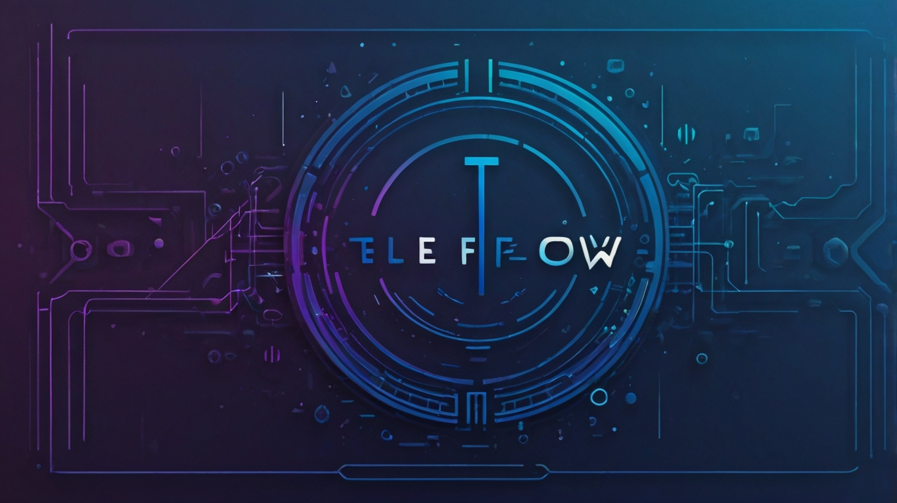

# TeleFlow-Bridge 

<p align="center">
  
  <br>
  <i>Seamlessly bridge Telegram channels to Discord servers with style</i>
</p>

<p align="center">
  <a href="#features">Features</a> •
  <a href="#installation">Installation</a> •
  <a href="#usage">Usage</a> •
  <a href="#versions">Versions</a> •
  <a href="#configuration">Configuration</a>
</p>

## 🌟 Features

- 🔄 Real-time message forwarding from Telegram to Discord
- 🖼️ Full media support (photos, videos, documents, stickers, voice messages)
- 🎨 Beautiful, color-coded embeds for different message types
- 📊 Dynamic bot status with real-time statistics
- 🔧 Easy configuration with environment variables
- 🎯 Two versions: Standard and VPN-enabled for restricted regions

## 🚀 Installation

1. Clone the repository:

```bash
git clone https://github.com/yourusername/TeleFlow-Bridge.git

cd TeleFlow-Bridge
```

2. Install required packages:

```bash
pip install -r requirements.txt
```

3. Set up your environment variables in `.env`:

```bash
DISCORD_TOKEN=your_discord_token
DISCORD_CHANNEL_ID=your_channel_id
TELEGRAM_TOKEN=your_telegram_token
TELEGRAM_CHANNEL_USERNAME=your_channel_username
```

## 📦 Versions

### Standard Version
- Located in `/standard`
- For unrestricted network environments
- Direct connection to Telegram and Discord APIs

### VPN-Enabled Version
- Located in `/vpn-enabled`
- Includes VPN integration for restricted regions
- Bypasses network limitations
- Ideal for Iranian servers and other restricted environments

## ⚙️ Configuration

### Required Environment Variables
- `DISCORD_TOKEN`: Your Discord bot token
- `DISCORD_CHANNEL_ID`: Target Discord channel ID
- `TELEGRAM_TOKEN`: Your Telegram bot token
- `TELEGRAM_CHANNEL_USERNAME`: Source Telegram channel username

### Optional Settings
- Custom embed colors
- Status update intervals
- Media processing options

## 🛠️ Usage

1. Set up your environment variables
2. Choose the appropriate version (standard/vpn-enabled)
3. Run the bot:

```bash
python telegram_to_discord_bot.py
```

## 🤖 Bot Commands

- `@botstatus` - View bot statistics and status
- `@bothelp` - Display available commands
- `@ping` - Check bot latency

## 🎨 Features in Detail

- **Dynamic Status**: Rotating bot status with real-time statistics
- **Media Support**: 
  - Photos (🖼️)
  - Videos (🎥)
  - Documents (📎)
  - Stickers (🎨)
  - Voice Messages (🎤)
  - Animations/GIFs (🎞️)
- **Beautiful Embeds**: Color-coded messages for different content types
- **Real-time Stats**: Message and media processing statistics

## 🔧 Dependencies

- python-telegram-bot
- discord.py
- python-dotenv
- httpx
- dnspython

## 📝 License

This project is licensed under the MIT License - see the [LICENSE](LICENSE) file for details.

## 🙋‍♂️ Author

Created by [D3F417](https://github.com/Sir-D3F417)

## 🤝 Contributing

Contributions, issues, and feature requests are welcome! Feel free to check the [issues page](https://github.com/Sir-D3F417/TeleFlow-Bridge/issues).
